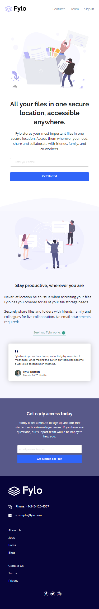
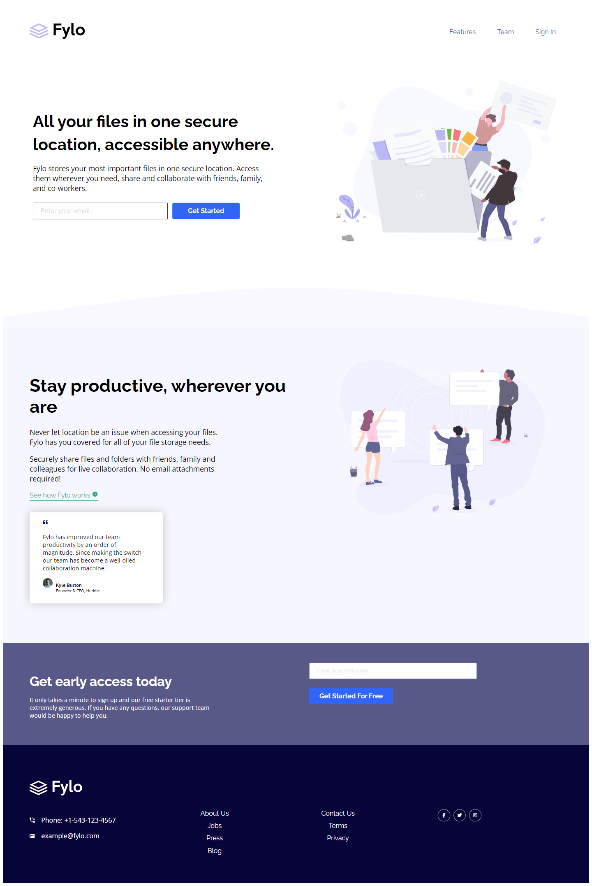

# Frontend Mentor - Fylo landing page with two column layout solution

This is a solution to the [Fylo landing page with two column layout challenge on Frontend Mentor](https://www.frontendmentor.io/challenges/fylo-landing-page-with-two-column-layout-5ca5ef041e82137ec91a50f5). Frontend Mentor challenges help you improve your coding skills by building realistic projects. 

## Table of contents

- [Overview](#overview)
  - [The challenge](#the-challenge)
  - [Screenshot](#screenshot)
  - [Links](#links)
- [My process](#my-process)
  - [Built with](#built-with)
  - [What I learned](#what-i-learned)
  - [Continued development](#continued-development)
  - [Useful resources](#useful-resources)
- [Author](#author)
- [Acknowledgments](#acknowledgments)

## Overview


### The challenge

Users should be able to:

- View the optimal layout for the site depending on their device's screen size
- See hover states for all interactive elements on the page

### Screenshot
- Mobile viw (375px)<br/>

---
- Laptop view (1440px)

---
- Active states and validation


### Links

- Solution URL: [Add solution URL here](https://your-solution-url.com)
- Live Site URL: [Add live site URL here](https://your-live-site-url.com)

## My process

- Set up the project file locally.
- Modify HTML elements and tags to fit the required design.
- Style with CSS, create the layout insuring it's visually appealing.
- Apply mobile-first workflow.
- Use media queries to adjust font sizes based on viewport width.
- Build layout for the desktop responsively.
- Add validaion for input fields with only CSS. (without JS)
- Add hovering states to all icons and links.
- Test website in different browsers and devices.

### Built with

- Semantic HTML5 markup
- CSS custom properties
- Flexbox
- CSS Grid
- Mobile-first workflow
- Responsive design
- Font Awesome

### What I learned

How to use ```::after```, ```::before``` and ```:invalid``` selectors:

```css
input:invalid + #error2::before{
    content: 'Please check your email';
    color: #fff;
    font-size: .8rem;
}
```

### Useful resources

- [CSS tricks](https://css-tricks.com/almanac/selectors/i/invalid/)

## Author

- Website - [Github](https://github.com/amrmabdelazeem)
- Frontend Mentor - [@amrmabdelazeem](https://www.frontendmentor.io/profile/amrmabdelazeem)